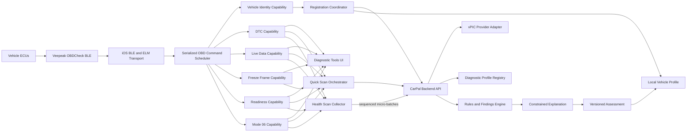
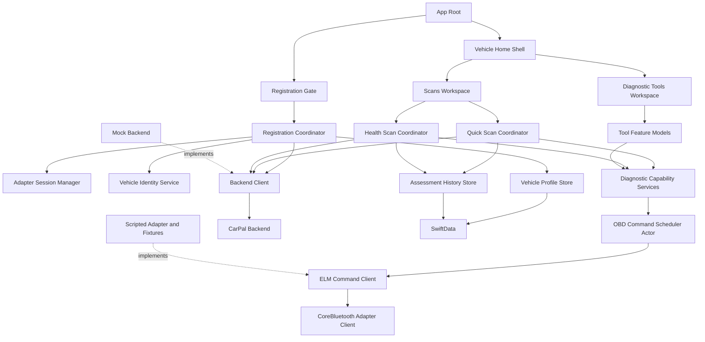
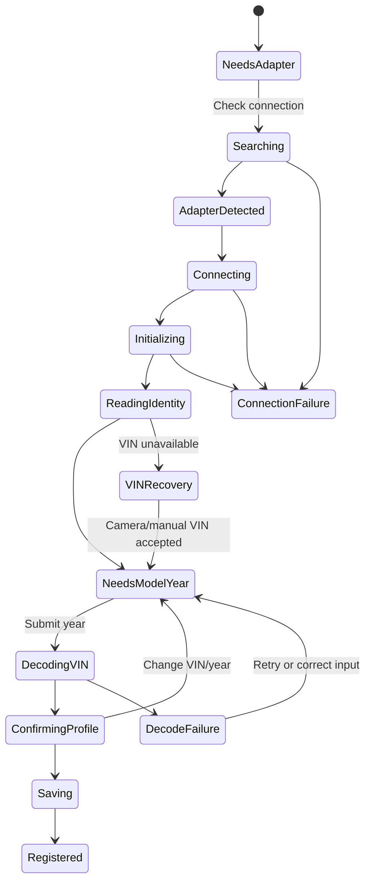
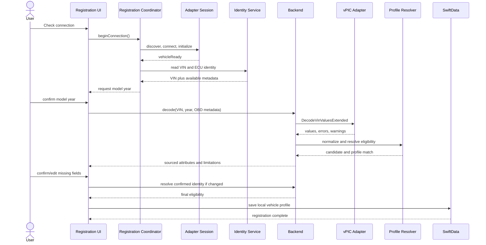
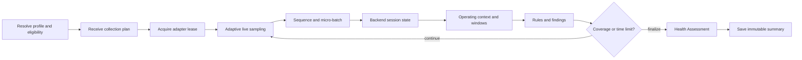
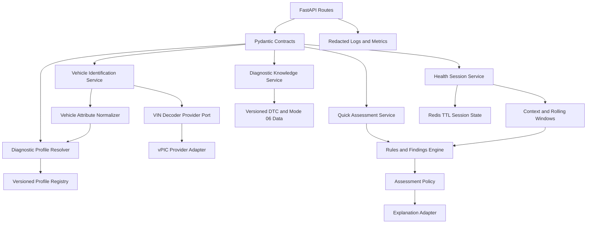

# CarPal - MVP Implementation Plan

## 1. Purpose

This document turns `documents/PROJECT_BRIEF.md` into a build-ready architecture
and delivery plan. It supersedes the earlier local-only scan architecture.

The MVP must prove that CarPal can repeatedly:

1. Require a real supported OBD adapter connection before first registration.
2. Read VIN and available ECU identity from the vehicle.
3. Enrich that identity through a backend VIN-decoding provider.
4. Let the user confirm or complete one locally saved vehicle profile.
5. Expose familiar read-only diagnostic tools over a shared OBD capability layer.
6. Build Quick Scan and Health Scan by orchestrating those same capabilities.
7. Produce cautious, evidence-linked findings without hardcoding the pilot
   vehicle into mobile or backend workflow code.

The MVP ships one enabled Health Scan diagnostic profile for the 2020 Lexus NX
300, one supported Veepeak OBDCheck BLE adapter, one iPhone app, and one locally
saved vehicle. The restriction is represented by versioned backend profile data,
not an `if` statement tied to make, model, or year.

## 2. Architecture Decisions

The following decisions are fixed for the MVP:

* Registration is OBD-first. A supported adapter must be discovered, connected,
  initialized, and able to establish a vehicle session before a vehicle can be
  saved.
* The app reads VIN through standard OBD vehicle-information commands. Camera or
  manual VIN entry may recover a failed VIN read, but neither bypasses the
  adapter-connection requirement.
* The user supplies or confirms model year before backend decoding because vPIC
  recommends including model year in VIN decode requests.
* The backend, not the iPhone, calls vPIC and normalizes provider-specific data.
* A missing VIN-decoder value means unknown. It must not be converted into a
  guessed value or interpreted as equipment being absent.
* Vehicle attributes retain value, source, and confirmation state. Numerical
  identity confidence is omitted until it can be supported by measured data.
* The saved vehicle profile remains local-first in SwiftData.
* The main landing page keeps the existing vehicle card and presents two
  workspaces: `Scans` and `Diagnostic Tools`.
* Standalone tools are implemented before intelligent scans. Quick Scan and
  Health Scan consume their capability services instead of duplicating OBD
  commands and parsers.
* The phone owns Bluetooth, ELM command execution, sample sequencing, local
  persistence, and UI state.
* The backend owns VIN-provider integration, diagnostic profile resolution,
  rule application, findings, assessment policy, and explanation policy.
* Production does not retain raw Health Scan telemetry after the active session.
* Clear Codes, active tests, broad enhanced manufacturer diagnostics, and
  user-facing raw-session export remain outside this MVP.

## 3. Existing Baseline

Milestones 1 through 3 produced reusable infrastructure:

* SwiftUI application shell and design system
* SwiftData vehicle and scan-history stores
* Vehicle Home card and curated static Lexus artwork
* Mock adapter scenarios for simulator testing
* CoreBluetooth Veepeak discovery and connection
* ELM327 initialization, command framing, timeouts, and response cleanup
* Standard PID parsing and typed scan errors
* Initial scan process and result screens

The current manual vehicle form, fixed seven-stage scan coordinator, and
on-device `HealthAssessmentEngine` are legacy architecture. They may remain
temporarily while the new vertical slices land, but they must not become the
foundation for new work. Unreachable code, obsolete tests, and unused assets
must be removed when each replacement slice is complete.

The Milestones 1-3 architecture refactor is complete. Connection state now
flows through `AdapterSessionManager`, ELM commands are serialized through
`OBDCommandScheduler`, and standard support/core-data composition lives in
`StandardOBDDiagnosticService` instead of `CoreBluetoothOBDClient`. The legacy
assessment engine remains in use only to preserve the current scan experience
until Milestone 8 replaces it with backend Quick Assessment.

---

# System Architecture

## 4. End-to-End Architecture



## 5. Dependency Rules

The architecture follows these dependency directions:

* UI depends on feature coordinators and domain contracts, not raw ELM text.
* Diagnostic tools and scan workflows depend on capability protocols.
* Capability implementations depend on one shared serialized command scheduler.
* Parsers convert responses into canonical observations before data reaches a
  screen, workflow, or network client.
* Quick Scan and Health Scan may compose capabilities but must not reimplement
  their commands or parsing.
* The mobile app consumes backend profile decisions; it does not decide Health
  Scan eligibility from vehicle strings.
* Backend domain services depend on provider interfaces, not directly on vPIC or
  an AI provider.
* AI can explain deterministic findings but cannot create, remove, or increase
  their severity.

## 6. Shared Contracts

All client/server contracts require a schema version. Important identifiers also
carry policy, rule-set, and diagnostic-profile versions where applicable.

```swift
struct VehicleAttribute<Value: Codable & Sendable>: Codable, Sendable {
    let value: Value?
    let source: AttributeSource
    let requiresConfirmation: Bool
}

struct CanonicalVehicleIdentity: Codable, Sendable {
    let vin: VehicleAttribute<String>
    let modelYear: VehicleAttribute<Int>
    let make: VehicleAttribute<String>
    let model: VehicleAttribute<String>
    let engine: VehicleAttribute<String>
    let fuelType: VehicleAttribute<String>
    let driveType: VehicleAttribute<String>
    let calibrationIDs: [String]
}

struct DiagnosticEligibility: Codable, Sendable {
    let profileID: String?
    let profileVersion: String?
    let quickScan: SupportLevel
    let healthScan: SupportLevel
    let limitations: [String]
}
```

`SupportLevel` must distinguish `supported`, `limited`, and `unsupported`.
Unknown identity and unsupported capability are not represented as `false`
defaults because they require different recovery and user messaging.

---

# Frontend Design

## 7. Frontend Responsibilities

The iOS app owns:

* Bluetooth permission and adapter discovery
* Stable adapter connection and connection-quality state
* ELM initialization and standard OBD command execution
* VIN, ECU identity, capabilities, and observations collected from the vehicle
* Serialized access to the adapter
* Registration state and local profile confirmation
* Local vehicle and final-assessment persistence
* Diagnostic tool interaction and short-lived graph buffers
* Quick Scan bundle collection
* Health Scan sampling, sequence numbers, bounded retry buffering, and progress
* Rendering backend eligibility, findings, statuses, confidence, and limitations
* Deterministic network-failure language that cannot be mistaken for a vehicle
  diagnosis

The iOS app does not own:

* vPIC field interpretation
* Diagnostic profile selection
* Vehicle-specific thresholds
* Finding correlation or category/overall status policy
* AI prompts or free-form diagnostic conclusions
* Long-term raw telemetry storage

## 8. App Navigation

When no vehicle is saved, app launch enters the registration flow. The main app
shell is unavailable until registration completes.

After registration, Vehicle Home is the landing page:

```text
+--------------------------------------------------+
| CarPal                              Profile / Gear |
|                                                  |
| [ Existing vehicle image and information card ] |
| [ Adapter status and Check Connection action   ] |
|                                                  |
|       [ Scans ]       [ Diagnostic Tools ]       |
| ------------------------------------------------ |
| Selected workspace content                       |
+--------------------------------------------------+
```

The two workspaces are a segmented control or equivalent content switch below
the persistent vehicle card, not two copies of Vehicle Home. Vehicle Profile,
history, and settings are secondary routes from the toolbar or relevant result.

## 9. Frontend Modules



### Module responsibilities

| Module | Responsibility |
| --- | --- |
| `RegistrationGate` | Chooses registration or Vehicle Home from local profile state |
| `RegistrationCoordinator` | Drives adapter connection, VIN read, decode, confirmation, and save |
| `AdapterSessionManager` | Owns Bluetooth/ELM lifecycle and publishes connection quality |
| `OBDCommandScheduler` | Serializes commands and gives one feature an exclusive operation lease |
| `VehicleIdentityService` | Reads Mode 09 VIN, calibration IDs, and ECU names when supported |
| `OBDCapabilityDiscovery` | Determines supported modes and PIDs without assuming availability |
| `DTCService` | Reads and normalizes confirmed, pending, and permanent DTCs |
| `LiveDataService` | Polls selected Mode 01 PIDs and emits timestamped observations |
| `FreezeFrameService` | Reads supported Mode 02 snapshots and associates evidence cautiously |
| `ReadinessService` | Reads MIL state, DTC count, and monitor support/completion |
| `Mode06Service` | Reads self-test results while preserving raw identity and limits |
| `QuickScanCoordinator` | Collects one canonical diagnostic bundle from capability services |
| `HealthScanCoordinator` | Runs the profile-provided collection plan and streams observations |
| `BackendClient` | Implements versioned identification, profile, tool-enrichment, and scan APIs |
| `VehicleProfileStore` | Persists one confirmed local profile and attribute provenance |
| `AssessmentHistoryStore` | Persists immutable final summaries, not raw telemetry |

## 10. Adapter Session and Concurrency

An ELM adapter is effectively a serial command channel. Multiple screens must
not poll it concurrently.

`OBDCommandScheduler` should be a Swift actor that:

* Allows only one command in flight
* Supports operation priority and cancellation
* Gives a tool or scan an exclusive lease for multi-command transactions
* Applies pacing and command-specific timeouts
* Records command latency and timeout counts without logging VIN or full payloads
* Stops background tool polling when its view disappears
* Rejects a second scan while another exclusive operation is active

The connection widget reflects `AdapterSessionManager` state only. It never
infers connection from a previous scan result. `Scan` actions remain disabled
until the user checks the connection and the session reaches `vehicleReady`.

## 11. Auto-Registration Flow

### Registration states



Registration requires a live adapter session even when VIN needs camera/manual
recovery. A stale previously discovered peripheral is not enough.

### Registration sequence



### Confirmation behavior

The confirmation form should prefill decoded values and visibly distinguish:

* Confirmed values
* Values requiring user confirmation
* Missing optional values
* Decode warnings or ambiguous mappings

The user may edit make, model, year, engine, fuel type, drive type, trim, custom
name, and colour. Changing identity fields re-runs profile resolution before
save. Colour and custom name remain user-sourced and do not affect diagnostic
eligibility.

## 12. Diagnostic Capability Layer

Each capability exposes typed observations and metadata rather than screen-ready
strings. Example:

```swift
protocol DTCReading {
    var confirmed: [DiagnosticTroubleCode] { get }
    var pending: [DiagnosticTroubleCode] { get }
    var permanent: [DiagnosticTroubleCode] { get }
}

struct Observation<Value: Codable & Sendable>: Codable, Sendable {
    let signal: SignalID
    let value: Value
    let unit: UnitID?
    let monotonicTimestamp: Duration
    let sourceECU: String?
    let quality: ObservationQuality
}
```

Initial capability-to-command mapping:

| Capability | Standard OBD source | MVP behavior |
| --- | --- | --- |
| VIN and ECU identity | Mode 09 | VIN required with recovery path; other identifiers best effort |
| DTCs | Modes 03, 07, and 0A | Group by confirmed, pending, and permanent |
| Live data | Mode 01 supported PIDs | User-selected values and short-lived graphs |
| Freeze frame | Mode 02 | Display available snapshot fields and limitations |
| Readiness | Mode 01 PID 01 | Show MIL, supported monitors, and completion state |
| ECU self-tests | Mode 06 | Interpret only known identity, scaling, units, and limit direction |

Unsupported responses are valid capability outcomes. Timeouts, malformed
responses, and disconnected sessions are typed operational failures.

## 13. Standalone Diagnostic Tools

Tools are delivered before intelligent scans because they validate the shared
transport, parser, and canonical-data layers independently.

Recommended order:

1. Trouble Codes and Readiness
2. Freeze Frame
3. Live Data list and graphing
4. Known Mode 06 results

Every tool should work with the scripted adapter in Simulator and the real
adapter on-device. Raw standard values may be available without backend
enrichment. Plain-language code knowledge or interpreted Mode 06 output must use
versioned backend data and clearly degrade when unavailable.

## 14. Quick Scan Composition

Quick Scan is a stationary snapshot orchestrator:


The coordinator calls the same services used by standalone tools. It adds
ordering, progress, cancellation, bundle validation, and backend submission.
Quick Scan does not display Health Scan category cards or a numerical score.

## 15. Health Scan Composition

Health Scan is enabled only when the backend resolves an enabled diagnostic
profile. For the MVP that is the 2020 Lexus NX 300 profile.

The backend returns a versioned collection plan containing required/optional
signals, priorities, context coverage, duration limits, rule-set version, and
known limitations. The iPhone validates the plan against discovered capability
and adapter throughput, but does not reinterpret its diagnostic policy.



The phone may buffer at most two minutes or 5 MB of unacknowledged observations,
whichever comes first. If the network does not recover, Health Scan ends as
`Unable to assess`, buffered telemetry is discarded, and the error is described
as a network failure.

## 16. Local Persistence

SwiftData stores:

* One confirmed vehicle profile with attribute provenance
* Last-known diagnostic eligibility and profile version for display only
* Final Quick and Health Assessment summaries
* Findings, aggregated evidence, confidence, limitations, and next actions
* Minimal standalone-tool preferences such as selected live PIDs

SwiftData does not store continuous raw Health Scan telemetry. Cached eligibility
must be refreshed before Health Scan and cannot authorize a scan by itself.

---

# Backend Design

## 17. Backend Responsibilities

The backend owns:

* Versioned request and response schemas
* VIN decode provider abstraction and vPIC integration
* Provider-field normalization, warnings, provenance, and confirmation state
* Vehicle diagnostic profile registry and resolver
* DTC knowledge and known Mode 06 interpretation data
* Quick Scan bundle validation and deterministic findings
* Health Scan session creation, deduplication, rolling windows, and finalization
* Operating-condition classification
* Diagnostic rules, evidence authority, category/overall status policy, and
  confidence calculation
* Constrained explanation generation and deterministic fallback
* Redacted operational metrics and policy-version audit fields

The backend does not own Bluetooth, ELM timing, the user's local saved profile,
or long-term raw telemetry.

## 18. Backend Modules



## 19. vPIC Provider Integration

The MVP provider adapter calls:

```text
GET https://vpic.nhtsa.dot.gov/api/vehicles/
    DecodeVinValuesExtended/{vin}?format=json&modelyear={year}
```

The adapter should map useful fields when present, including:

* VIN and model year
* Make, model, series, vehicle type, and body class
* Engine model/configuration, displacement, and cylinder count
* Primary and secondary fuel type
* Drive type and transmission style
* Manufacturer and plant country
* vPIC error code and error text

Provider values are untrusted external input. The adapter must trim placeholders,
preserve unknowns, validate model year and VIN consistency, and return warnings
without silently repairing identity.

vPIC is optimized for vehicles intended for U.S. sale or import. Canadian-market
coverage can be incomplete. The provider is therefore replaceable, and the
registration UI must allow confirmation/correction. Rate control and occasional
maintenance are expected; use bounded timeouts, limited retries with jitter, and
short-lived response caching keyed by a server-secret HMAC of the VIN where
useful.

VIN is sensitive vehicle identity. Never place it in application logs, analytics,
crash breadcrumbs, or AI prompts. The backend should retain it only for the
active request unless a later privacy-reviewed feature explicitly requires more.

## 20. Diagnostic Profile Registry

The registry is version-controlled backend data:

```yaml
id: lexus-nx300-2020-na
version: 1.0.0
state: enabled
match:
  make: LEXUS
  model: NX 300
  years: [2020]
  market: [CA, US]
health_scan:
  enabled: true
  collection_plan: nx300-2020-v1
  rule_set: nx300-2020-rules-v1
limitations:
  - Standard OBD-accessible systems only
```

This is illustrative, not the final profile content. Matching should use
normalized identity and available engine, powertrain, market, and calibration
data. An ambiguous match cannot enable Health Scan.

Adding another supported vehicle should require profile data, rule data,
fixtures, expert review, and real-vehicle validation. Core API routes,
orchestrators, and assessment code should remain unchanged.

## 21. API Contracts

### `POST /v1/vehicle-identification/decode`

Request:

```json
{
  "schema_version": "1",
  "vin": "REDACTED_IN_LOGS",
  "model_year": 2020,
  "obd_identity": {
    "calibration_ids": [],
    "ecu_names": []
  },
  "adapter": {
    "model": "veepeak-obdcheck-ble",
    "protocol": "ISO 15765-4 CAN"
  }
}
```

Response:

```json
{
  "schema_version": "1",
  "candidate": {
    "make": {"value": "Lexus", "source": "VIN_DECODER", "requires_confirmation": false},
    "model": {"value": "NX 300", "source": "VIN_DECODER", "requires_confirmation": false},
    "model_year": {"value": 2020, "source": "USER", "requires_confirmation": false},
    "fuel_type": {"value": "Gasoline", "source": "VIN_DECODER", "requires_confirmation": false},
    "drive_type": {"value": null, "source": "VIN_DECODER", "requires_confirmation": true}
  },
  "decode_warnings": ["Drive type was not encoded or available"],
  "eligibility": {
    "profile_id": "lexus-nx300-2020-na",
    "profile_version": "1.0.0",
    "quick_scan": "supported",
    "health_scan": "supported",
    "limitations": []
  }
}
```

### `POST /v1/diagnostic-profiles/resolve`

Re-resolves eligibility after the user changes diagnostic identity fields or
when newly discovered ECU capability/calibration data becomes available.

### `POST /v1/diagnostic-tools/dtcs/interpret`

Accepts normalized DTC states and vehicle context. Returns versioned code
descriptions, evidence authority, limitations, and plain-language guidance. It
must not claim a failed component from a code alone.

### `POST /v1/quick-scans`

Accepts one canonical diagnostic bundle and returns a flat Quick Assessment with
detected operating context, findings, confidence, limitations, and next action.

### Health Scan endpoints

```text
POST /v1/health-scans
POST /v1/health-scans/{session_id}/observations
POST /v1/health-scans/{session_id}/finalize
```

Observation submission is idempotent by session and sequence range. The server
acknowledges accepted ranges so the phone can discard them from its retry buffer.

## 22. Backend Failure Policy

| Failure | Backend behavior | App behavior |
| --- | --- | --- |
| vPIC timeout/unavailable | Return typed dependency failure | Preserve VIN/year and offer retry; do not register guessed identity |
| vPIC partial decode | Return candidate with unknown fields and warnings | Ask user to confirm or fill missing values |
| No diagnostic profile match | Return explicit limited/unsupported eligibility | Allow tools or Quick Assessment as supported; disable Health Scan |
| Invalid observation schema | Reject with stable code and field details | Stop/retry appropriate stage; never label as vehicle fault |
| Duplicate Health batch | Return existing acknowledgement | Discard acknowledged local batch |
| Health session expired | Reject finalization with typed expiry | End as `Unable to assess` |
| Rule engine failure | Do not generate AI explanation | Return typed assessment failure |
| AI timeout/invalid output | Return deterministic explanation fallback | Display validated deterministic result |

## 23. Security and Observability

* Use HTTPS for all backend communication.
* Keep provider and AI credentials server-side.
* Redact VIN, raw adapter payloads, and session observations from logs.
* Record schema version, profile version, rule-set version, command latency,
  timeout counts, batch acknowledgement latency, and failure codes.
* Apply request-size limits and strict Pydantic validation.
* Use generated opaque session IDs rather than VIN-derived identifiers.
* Set short Redis TTLs and remove active-session telemetry after finalization or
  expiry.
* Do not add a server-side vehicle-profile database for the single-user MVP;
  confirmed profiles remain in SwiftData.

---

# UX Design

## 24. UX Principles

* Registration explains why the adapter is required before asking for details.
* Connection state comes from the transport layer, never from optimistic UI.
* Unknown values remain visibly unknown and editable.
* Source and confirmation state support trust without overwhelming the default view.
* Tools answer a specific technical question; scans answer "How is my car doing?"
* Missing capability is not presented as a vehicle defect.
* Every backend or transport failure names the failed operation and recovery.
* Health language is limited to OBD-accessible systems.

## 25. Registration Experience

### Screen A: Connect scanner

Shows adapter setup instructions, Bluetooth state, live search status, and one
primary `Check connection` action. `Continue` is disabled until the state is
`vehicleReady`.

Status progression:

```text
[ ] Bluetooth available
[ ] Veepeak adapter found
[ ] Adapter connected
[ ] Vehicle communication established
```

### Screen B: Read vehicle identity

Shows VIN retrieval as a real operation, not a fake progress timer. Once VIN is
read, asks the user for model year before decode. If VIN is unavailable, offers
camera/manual VIN recovery while keeping the live adapter session requirement.

### Screen C: Confirm vehicle

Displays the decoded candidate with missing or uncertain values highlighted.
Custom name and colour are requested here because vPIC does not provide the
owner's nickname and generally cannot identify exterior colour reliably.

The final action is `Register vehicle`. It saves only after required fields are
valid and profile eligibility has been resolved.

## 26. Vehicle Home and Workspaces

The existing vehicle image card remains the visual anchor. It displays custom
name, year/make/model, selected colour artwork or fallback, and basic confirmed
identity. An `Edit` route exposes provenance and uncertain fields.

Below it:

### Scans workspace

* Quick Scan card with stationary requirement and expected duration
* Health Scan card with eligibility, expected duration, and pilot limitations
* Latest assessment summary and history route
* Disabled state explaining whether connection, backend, or profile eligibility
  is missing

### Diagnostic Tools workspace

* Trouble Codes
* Live Data
* Freeze Frame
* Emissions Readiness
* ECU Self-Tests / Mode 06

Each tool shows availability after capability discovery. Unsupported tools stay
visible with an explanation rather than disappearing.

## 27. Diagnostic Tool Screens

### Trouble Codes

Groups confirmed, pending, and permanent codes. Each row shows code, validated
description when available, MIL relationship, and evidence limitations. No
`Clear Codes` action is included in this MVP.

### Live Data

Starts with a searchable supported-PID list. The user selects a small number of
signals for current values and short-lived graphs. Leaving the screen stops
polling and clears raw graph buffers unless the user is in an active Health Scan.

### Freeze Frame

Shows the snapshot captured by the ECU, the associated code only when the ECU
relationship is known, units, and unavailable fields. It does not imply that the
snapshot describes current conditions.

### Emissions Readiness

Separates supported-ready, supported-not-ready, and unsupported monitors. It
explains that readiness is not a complete mechanical-health result.

### ECU Self-Tests / Mode 06

Shows only tests whose identity, scaling, units, and limit direction are known.
Unknown tests can be counted as uninterpreted evidence but should not receive a
consumer diagnosis.

## 28. Scan Process and Results

Quick Scan progress should reflect composed tool operations, for example:

```text
[check] Adapter connected
[check] Trouble codes retrieved
[check] Emissions readiness retrieved
[warn ] Freeze frame unavailable
[work ] Capturing live-data snapshot
[     ] Preparing assessment
```

Health Scan progress focuses on detected operating condition and useful
coverage rather than a fixed to-do list:

```text
Detected condition: Warm idle
Connection quality: Stable
Session coverage: 3 of 5 categories assessable
Current limitation: Cruise context not yet observed
```

Quick results use a flat assessment. Health results use the five category
statuses defined in the brief, an overall status, separate confidence, findings,
limitations, and next action. Numerical health scores remain deferred.

---

# Delivery Plan

## 29. Milestones

### Milestones 1-3: Existing frontend and transport baseline

Status: implemented and refactored behind the shared session, scheduler, and
diagnostic capability boundaries. Continued physical-hardware validation is
required.

Keep the working BLE/ELM transport, parsers, mock path, persistence, design
system, and vehicle card. Refactor them behind the new contracts as later slices
land.

### Milestone 4: Contracts and backend foundation

Status: implemented. The backend is database-free in this milestone; Health
Scan session state and rules remain scheduled for later milestones.

* Create the backend project structure with FastAPI and Pydantic.
* Define canonical vehicle identity, provenance, eligibility, observation, and
  error contracts.
* Implement the VIN provider port and vPIC adapter with fixtures.
* Implement the versioned diagnostic profile registry with only the 2020 Lexus
  NX 300 Health Scan profile enabled.
* Add `/vehicle-identification/decode` and `/diagnostic-profiles/resolve`.
* Add VIN redaction, provider timeout/retry policy, and contract tests.
* Add generated or fixture-driven Swift API models and a mock backend client.

Exit criterion: a known VIN fixture plus model year returns a normalized,
source-attributed candidate and deterministic eligibility without hardcoded
vehicle branches.

### Milestone 5: OBD-gated auto-registration

* Replace first-launch manual setup with the registration gate.
* Extract `AdapterSessionManager` from scan-specific coordination.
* Implement Mode 09 VIN and available ECU identity retrieval.
* Implement model-year prompt and backend decode request.
* Build confirmation/edit behavior with unknown values and provenance.
* Persist the confirmed profile locally and route to Vehicle Home.
* Retain manual/camera VIN only as VIN-read recovery after adapter readiness.

Exit criterion: a fresh install cannot register before a real or explicitly
mocked adapter reaches `vehicleReady`; registration completes from OBD VIN,
backend decode, confirmation, and local save.

### Milestone 6: Shared diagnostics and two-workspace home

* Add the `Scans` and `Diagnostic Tools` workspace switch below the vehicle card.
* Implement the serialized scheduler and exclusive operation leases.
* Extract capability discovery from the legacy scan coordinator.
* Implement DTC and readiness services, screens, mocks, and hardware tests.
* Add connection-aware availability and typed failure UI.

Exit criterion: DTC and readiness tools independently retrieve and display real
data without invoking Quick Scan.

### Milestone 7: Remaining read-only tools

* Implement freeze-frame retrieval and presentation.
* Implement supported-PID browsing and bounded live-data graphing.
* Implement known Mode 06 parsing and cautious presentation.
* Add optional backend DTC/Mode 06 knowledge enrichment.
* Verify command scheduling while switching tools and cancelling operations.

Exit criterion: each standalone tool uses the shared capability service later
consumed by scan workflows.

### Milestone 8: Quick Scan orchestration

* Replace the legacy fixed-data scan with composition over capability services.
* Build and validate the canonical Quick Scan bundle.
* Implement backend evidence correlation and flat Quick Assessment policy.
* Store immutable final summaries locally.
* Remove superseded on-device scoring and unreachable scan code.

Exit criterion: Quick Scan retrieves the same evidence visible in standalone
tools and returns an evidence-linked assessment without numerical scoring.

### Milestone 9: Health Scan pilot

* Finalize the NX 300 collection plan and rule-set fixtures.
* Implement backend Health session APIs and Redis TTL state.
* Implement adaptive client polling, sequencing, micro-batches, and bounded retry.
* Implement operating-condition classification and rolling windows.
* Produce category statuses, overall status, confidence, and limitations.
* Validate completion by coverage or maximum duration.

Exit criterion: repeated pilot sessions on the 2020 Lexus NX 300 complete or
truthfully return `Unable to assess`, with every finding linked to evidence and
policy versions.

### Milestone 10: Explanation and MVP validation

* Add constrained AI explanation over deterministic findings.
* Validate output and implement deterministic fallback.
* Run simulator fixtures for good, bad, DTC, incomplete, and network-loss cases.
* Run repeated real adapter/vehicle sessions.
* Complete accessibility, privacy, and non-technical decision-clarity reviews.
* Remove obsolete code, tests, catalog assumptions, and assets.

## 30. Testing Strategy

### Frontend unit tests

* Registration state transitions and connection gate
* Mode 09 multi-frame VIN parsing and invalid VIN handling
* Attribute provenance and confirmation rules
* API contract decoding and unknown-field preservation
* Adapter session state and command scheduler serialization
* Capability support, unsupported responses, parsing, units, and quality
* Quick Scan composition without duplicate command logic
* Health sequencing, acknowledgements, retry limits, and cancellation
* Profile eligibility rendering without make/model branches
* SwiftData migration from or removal of legacy manual profiles

### Frontend integration and UI tests

* Fresh launch through mocked adapter, VIN decode, confirmation, and Home
* Adapter not found, disconnect, VIN unavailable, vPIC timeout, and partial decode
* Two-workspace navigation while preserving the vehicle card
* Every standalone diagnostic tool with supported and unsupported fixtures
* Quick Scan success, partial evidence, and `Unable to assess`
* Health Scan progress, network recovery, timeout, and final summary
* Dynamic Type, VoiceOver, contrast, reduced motion, and sensitive-data redaction

### Backend tests

* vPIC fixture mapping, placeholders, missing values, errors, and timeouts
* VIN/model-year validation and log redaction
* Diagnostic profile exact, ambiguous, limited, and unsupported matches
* Schema compatibility and stable error codes
* DTC and Mode 06 knowledge version selection
* Quick bundle validation, evidence correlation, and status policy
* Health batch ordering, deduplication, TTL expiry, rolling windows, and finalize
* AI output rejection when it changes deterministic findings or urgency
* Raw telemetry deletion after finalization and expiry

### Hardware validation

Run repeated tests with the Veepeak OBDCheck BLE and 2020 Lexus NX 300:

* Cold discovery and first registration
* Mode 09 VIN consistency across sessions
* Reconnect after app relaunch and adapter loss
* Ignition-on/engine-off and warm-engine contexts
* DTC, readiness, freeze frame, live data, and Mode 06 support behavior
* Tool cancellation and switching without command overlap
* Quick Scan repeatability
* Health Scan throughput, context coverage, and network interruptions

Record command latency, timeout rate, unsupported responses, session completion,
coverage, and whether user recovery guidance resolves each failure.

## 31. MVP Completion Criteria

The redesigned MVP is complete when:

* A user cannot register a vehicle without a ready supported adapter session.
* The app retrieves VIN from OBD or uses a VIN recovery path after adapter
  readiness, then asks for model year and decodes through the backend.
* Partial vPIC data remains editable and source-attributed.
* The confirmed vehicle is saved locally and displayed on the existing Home card.
* Home exposes distinct `Scans` and `Diagnostic Tools` workspaces.
* DTCs, live data, freeze frame, readiness, and known Mode 06 are independently
  usable through shared capability services.
* Quick Scan composes those services rather than duplicating OBD behavior.
* Health Scan eligibility comes from the profile registry, whose only enabled
  MVP Health profile is the 2020 Lexus NX 300.
* Health Scan streams bounded session data and produces evidence-linked category
  statuses, overall status, confidence, limitations, and next action.
* Numerical health scoring is absent.
* Network, provider, transport, unsupported-capability, and insufficient-evidence
  failures are distinguishable from vehicle findings.
* VIN and raw telemetry are excluded from logs and AI prompts.
* Mock and real-hardware paths are repeatable, and obsolete architecture has been
  removed rather than left unreachable.

## 32. External Reference

The backend VIN adapter is based on the official NHTSA vPIC Vehicle API:

* <https://vpic.nhtsa.dot.gov/api/Home/Index>

The integration must remain behind a provider interface because vPIC applies
traffic controls, can be unavailable for maintenance, and may return limited
data for vehicles not intended for U.S. sale or import.
