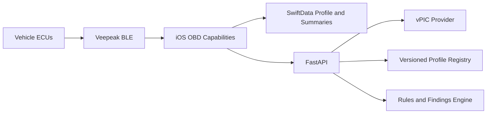

# CarPal MVP Tech Stack

## Summary

CarPal uses a native iOS client with a focused diagnostic backend. The phone
owns hardware communication and local user state. The backend owns external
vehicle-data integrations, diagnostic-profile resolution, and the assessment
policy that must evolve independently of App Store releases.

The MVP remains database-free and local-first. Moving diagnostic interpretation
to the backend does not move Bluetooth control or raw telemetry history to the
cloud.

## iOS App

* Language: Swift 6
* UI: SwiftUI
* Bluetooth: CoreBluetooth
* Persistence: SwiftData
* Networking: URLSession with versioned Codable contracts
* Concurrency: Swift structured concurrency and actors
* Charts: Swift Charts
* Tests: Swift Testing and XCTest for UI tests

The iPhone owns adapter discovery, BLE/ELM transport, serialized OBD commands,
capability services, scan sequencing, local vehicle profiles, and final summary
history. For standalone DTC and readiness tools, it sends bounded raw ELM
responses to versioned backend parsing endpoints and displays normalized results.

## Backend

* Language: Python 3.12+
* API: FastAPI
* Contracts and validation: Pydantic 2
* HTTP client: HTTPX
* Server: Uvicorn
* Tests: pytest with HTTPX transports and deterministic provider fixtures
* Quality: Ruff and strict mypy
* Database: none for the MVP foundation

The backend owns standard diagnostic parsing, the versioned DTC knowledge
catalog, vPIC integration, provider normalization, provenance and confirmation
metadata, diagnostic-profile resolution, and eventually deterministic Quick and
Health Assessment rules. External services sit behind provider ports so tests
and local development do not depend on live network access.

## System Boundary

The backend never controls Bluetooth or ELM timing. The app never calls vPIC,
selects a Health Scan profile from make/model strings, or embeds diagnostic
threshold policy in PID parsing.

## Initial API Surface

Milestone 4 provides:

* `GET /health`
* `POST /v1/vehicle-identification/decode`
* `POST /v1/diagnostic-profiles/resolve`
* `POST /v1/diagnostics/trouble-codes/parse`
* `POST /v1/diagnostics/readiness/parse`

Later milestones add remaining read-only tools, Quick Assessment, and Health
Scan session APIs. All contracts are schema-versioned. VIN is used only for the
active provider request and is excluded from application logs and error bodies.

## Diagnostic and AI Policy

Deterministic rules create findings, category status, overall status,
confidence, limitations, and next actions. Rule metadata records applicability
and evidence authority. ECU-provided diagnostics and limits take precedence
over generic heuristics.

AI is deferred until deterministic assessment output exists. It may explain
validated findings but cannot create findings or increase their severity.

## Deferred Infrastructure

The MVP does not require authentication, PostgreSQL, cloud scan history, or
cross-device synchronization. Redis is introduced only when Health Scan needs
short-lived server session state; it is not part of the Milestone 4 identity
service.

## Validation Criteria

The stack is validated when:

* The app repeatedly communicates with the supported Veepeak adapter.
* A fixture-driven Swift client and backend contract remain compatible.
* A VIN and confirmed year produce a source-attributed candidate.
* Only an unambiguous enabled backend profile authorizes Health Scan.
* Provider failures return typed retry behavior without exposing VIN.
* Backend tests run without internet access.
