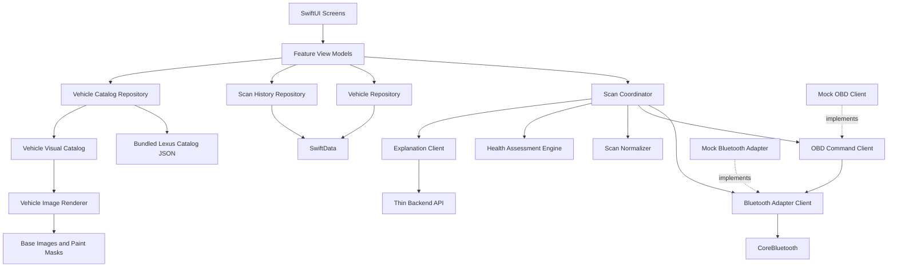
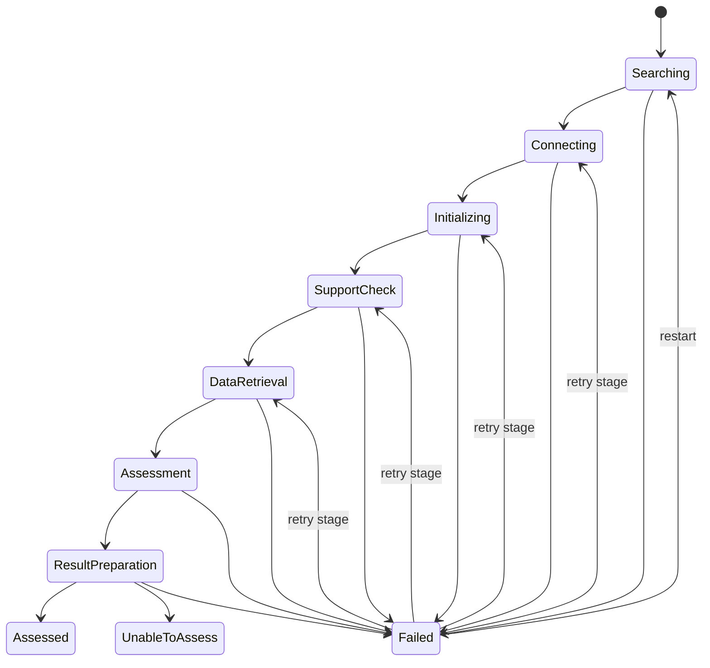
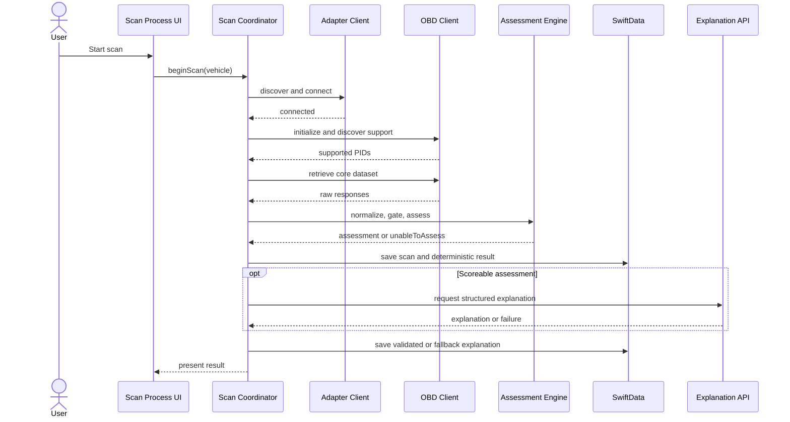
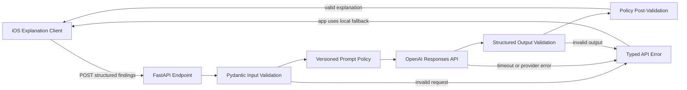

# CarPal - MVP Implementation Plan

## 1. Purpose

This document turns the MVP scope in `PROJECT_BRIEF.md` into a build-ready
implementation plan.

The MVP must prove that CarPal can repeatedly:

1. Register one vehicle.
2. Connect to a Veepeak OBDCheck BLE adapter.
3. Retrieve a fixed set of standard OBD-II data.
4. Produce either a cautious health assessment or `Unable to assess`.
5. Explain the result and next action to a non-technical driver.

The iPhone app is local-first and owns scanning, deterministic assessment, and
persistence. The thin backend only produces a structured plain-language
explanation from findings already validated by the app.

---

## 2. Delivery Strategy

Implementation should proceed through vertical slices. Each milestone must
produce a testable user outcome rather than only infrastructure.

### Milestone 1: Local app foundation

* Create the SwiftUI app and module boundaries.
* Add SwiftData models and a single-vehicle repository.
* Implement Vehicle Setup, Vehicle Home, and Edit Vehicle.
* Add the bundled Canadian Lexus NX/RX catalog and dependent profile fields.
* Add static visual pairs for all seven supported NX/RX body phases.
* Use mock vehicle and assessment data.

### Milestone 1A: Runtime vehicle colour system (Complete)

Milestone 1A was completed before Milestone 2. The delivered implementation:

* Loads a versioned bundled JSON catalog for Canadian Lexus NX and RX model
  years 2015 through 2026.
* Defines the dependent Make -> Series -> Year -> Variant -> Trim -> Exterior
  Colour chain and derives fuel type from the selected variant.
* Provides pixel-aligned base-image and paint-mask pairs for seven NX/RX body
  phases plus the defensive unsupported-vehicle fallback.
* Uses `VehicleImageRenderer` to apply tuned light, dark, neutral, and saturated
  colour recipes only through each asset's paint mask.
* Resolves a visual by Lexus series and model-year body phase. Non-catalog saved
  profiles fail closed and are removed; malformed in-memory identities use the
  colour-aware default vehicle defensively.
* Covers 2015-2026 catalog coverage, dependency validation, legacy-profile
  removal, phase matching, palette mapping, and asset availability with tests.
* Was visually verified in the iOS Simulator using white, black, red, green,
  and blue profiles. Painted panels change while windows, tires, wheels, lights,
  grille, badges, and trim retain their source appearance.

Automated pixel snapshot testing remains a regression-hardening follow-up. The
MVP acceptance criterion is currently protected by deterministic unit tests and
the documented simulator visual check.

### Milestone 2: Complete no-AI scan experience (Complete)

* Define the adapter and OBD command protocols.
* Implement a scripted mock adapter.
* Build the seven-stage scan coordinator.
* Add minimum-data gating and minimal deterministic assessment rules.
* Implement Scan Process, Scan Result, and local scan history.

This is the first meaningful end-to-end demo. It must work without Bluetooth
hardware, a backend, or AI.

The delivered implementation:

* Separates Bluetooth discovery/connection and OBD command execution behind
  injectable protocols used by both the scripted test client and CoreBluetooth client.
* Provides paced scripted scenarios for a scoreable diagnostic finding,
  healthy core data, insufficient core data, and a connection interruption.
* Runs the seven visible stages through `ScanCoordinator`, with one active
  stage, stable diagnostic failure codes, retry guidance, cancellation, and a
  non-blocking optional-data limitation.
* Normalizes the fixed mock dataset and applies a deterministic minimum-data
  gate before any score is allowed.
* Produces conservative `Good`, `Service soon`, `Urgent warning`, or
  `Unable to assess` results without backend or AI availability.
* Persists complete result snapshots in SwiftData so historical status, score,
  findings, explanation, action, completeness, and technical context remain
  available offline without recomputation.
* Implements Scan Process, Scan Result, and Scan History and updates Vehicle
  Home from the latest stored result.
* Covers the assessment gate, healthy and DTC rules, seven-stage success,
  typed connection failure, insufficient-data outcome, and history persistence
  with deterministic tests.

The mock remains available only through explicit debug launch arguments. Production
composition now uses the real adapter client described in Milestone 3. Backend
explanation, user-selectable debug scenarios, and production settings remain later work.

### Milestone 3: Real adapter integration (Implementation complete; hardware validation pending)

* Implemented CoreBluetooth power-state handling, advertisement discovery by supported
  Veepeak product name, connection, dynamic GATT serial-characteristic discovery, and
  notification subscription. The adapter is not shown as connected before this completes.
* Implemented ELM327 reset/configuration and automatic vehicle-protocol selection.
* Implemented Mode 01 PID capability discovery and fixed core sensor retrieval, plus
  Mode 03 DTC parsing and best-effort freeze-frame detection.
* Implemented prompt-delimited command buffering, command timeouts, response cleanup,
  standard PID conversion, and stage-specific transport error mapping.
* Retained the scripted adapter solely for deterministic tests and explicit debug runs.
* Pending: validate repeated scans and discovered GATT characteristics using the physical
  Veepeak OBDCheck BLE and 2020 Lexus NX 300.

### Milestone 4: Thin backend and explanation

* Create the FastAPI service and structured request/response models.
* Integrate the OpenAI Responses API.
* Validate all generated output before returning or displaying it.
* Add deterministic app-side fallback copy for timeout, network, and invalid
  response cases.

### Milestone 5: Reliability and MVP validation

* Test reconnects, interruptions, missing PIDs, and partial datasets.
* Complete the seven-screen UI and accessibility pass.
* Run repeatable real scans across multiple sessions.
* Conduct the decision-clarity test with non-technical users.

---

# Frontend Design

## 3. Frontend Responsibilities

The iOS app owns:

* Vehicle profile creation, editing, display, and persistence
* Supported-model image resolution and runtime body-colour rendering
* Bundled vehicle catalog loading and dependent-selection validation
* BLE authorization, discovery, connection, and disconnection
* Adapter initialization and OBD-II command execution
* PID support discovery and core data retrieval
* Scan normalization and validation
* Deterministic assessment, score eligibility, and next-action category
* Local scan and assessment history
* Backend explanation requests and deterministic fallback
* All user-facing states, including `Unable to assess`

## 4. Frontend Modules



### Module definitions

| Module | Responsibility |
| --- | --- |
| `VehicleProfile` | Vehicle identity and editable profile fields |
| `VehicleRepository` | Read and persist the single vehicle |
| `LexusVehicleCatalogRepository` | Decode and validate the bundled Canadian NX/RX catalog and answer dependent-picker queries |
| `VehicleVisualCatalog` | Resolve a normalized vehicle identity to an exact visual asset set or the default fallback |
| `VehicleImageRenderer` | Apply a colour recipe through the paint mask while preserving vehicle detail |
| `BluetoothAdapterClient` | Discover, connect to, and monitor the supported adapter |
| `OBDCommandClient` | Initialize the adapter and execute OBD-II commands |
| `ScanCoordinator` | Advance the staged scan state machine and map errors |
| `ScanNormalizer` | Convert raw responses into typed readings |
| `HealthAssessmentEngine` | Apply data gates, deterministic rules, score, and action |
| `AssessmentExplanationClient` | Request backend explanation or return fallback copy |
| `ScanHistoryRepository` | Persist scans, findings, and assessments |

## 5. Core Frontend Models

The exact names may change during implementation, but these concepts should
remain explicit:

```swift
struct VehicleProfile
struct LexusVehicleCatalog
struct VehicleVisualKey
struct VehicleVisualAsset
enum VehiclePaintColor
struct ScanSession
struct NormalizedScan
struct SensorReading
struct DiagnosticTroubleCode
struct AssessmentFinding
struct HealthAssessment
struct ExplanationContent
```

`HealthAssessment` must represent two valid outcomes:

* `assessed`: includes status, eligible score, completeness, findings, and action
* `unableToAssess`: includes the blocking reason, completeness, and next action

`Unable to assess` is not a transport exception. It is a successful scan outcome
where the assessment gate prevents a trustworthy conclusion.

## 6. Scan State Machine

The scan uses a bounded, guided sequence rather than an open-ended live
dashboard.



The seven visible stages are:

1. Searching for adapter
2. Connecting to adapter
3. Initializing adapter
4. Checking supported vehicle data
5. Retrieving vehicle data
6. Assessing vehicle health
7. Preparing your result

Only one stage may be active at a time. Previously completed stages remain
visible so the user can understand progress and identify where a failure
occurred.

## 7. Typed Scan Failures

Transport and parsing details must be converted into domain errors at the scan
coordinator boundary.

```swift
enum ScanStage {
    case searching
    case connecting
    case initializing
    case supportCheck
    case dataRetrieval
    case assessment
    case resultPreparation
}

enum ScanError: Error {
    case adapterNotFound
    case bluetoothUnavailable
    case connectionFailed
    case initializationFailed
    case unsupportedVehicleData
    case dataRetrievalFailed
    case incompleteCoreData
    case assessmentFailed
    case resultBuildFailed
}
```

Each presented error needs:

* Stage
* Stable diagnostic code
* User-facing message
* Troubleshooting guidance
* Whether retry is allowed
* Optional underlying technical context for debug logging

The implementation may use associated values or a separate
`ScanFailureContext` type to carry this information. Raw `CBError`, timeout,
adapter response, and parser errors should not leak directly into the UI.

`incompleteCoreData` requires special handling. If data retrieval completed but
the minimum-data gate is not satisfied, it should normally become an
`Unable to assess` result rather than a red scan failure.

## 8. Frontend Scan Process



The result must not depend on backend availability. If explanation generation
fails, the app displays deterministic fallback language derived from the
validated status, findings, and next-action category.

---

# Backend Design

## 9. Backend Responsibilities

The backend owns:

* Secure OpenAI credentials
* Versioned system instructions and explanation policy
* Structured AI request and response validation
* Optional enrichment from a controlled DTC knowledge source
* Basic request logging without unnecessary vehicle identifiers

The backend does not own:

* BLE or OBD-II communication
* Raw scan orchestration
* Vehicle profile persistence
* Score calculation
* Minimum-data gating
* Safety-sensitive status or next-action decisions

## 10. Backend Process



## 11. Initial API Contract

### `POST /v1/assessments/explain`

The request contains only the context needed to explain the result:

```json
{
  "schema_version": "1",
  "vehicle": {
    "year": 2020,
    "make": "Lexus",
    "model": "NX 300"
  },
  "assessment": {
    "status": "service_soon",
    "score": 62,
    "completeness": 0.91,
    "next_action": "arrange_diagnostic_inspection"
  },
  "findings": [
    {
      "code": "P0171",
      "severity": "attention",
      "validated_summary": "System too lean"
    }
  ]
}
```

The response is limited to presentation content:

```json
{
  "schema_version": "1",
  "summary": "The engine detected a lean air-fuel mixture.",
  "why_it_matters": "This can affect engine performance and fuel use.",
  "urgency": "Arrange an inspection soon.",
  "next_action_text": "Book a diagnostic inspection.",
  "limitations": "This assessment uses standard OBD-II data only."
}
```

The service must reject unsupported schema versions and malformed findings.
Generated content must not alter the status, score, completeness, or
next-action category supplied by the app.

## 12. Backend Failure Policy

The API should return stable machine-readable error codes for:

* Invalid request
* Unsupported schema version
* Provider timeout
* Provider unavailable
* Invalid generated output
* Policy validation failure

The iOS app treats all of these as explanation failures and immediately uses its
local fallback. A backend failure must not invalidate or delete a completed
local scan.

---

# UX Design

## 13. UX Principles

* Lead with the decision the driver needs to make.
* Keep raw technical data behind progressive disclosure.
* Explain uncertainty without presenting missing data as vehicle damage.
* Never imply that a good score guarantees safety.
* Preserve user context during connection and scan failures.
* Use one clear primary action on each screen.

## 14. Navigation Model

The MVP contains seven screens:

1. Vehicle Setup
2. Vehicle Home
3. Scan Process
4. Scan Result
5. Edit Vehicle
6. Scan History
7. Settings

Vehicle Home is the main destination after setup. Scan Result can be opened
from a newly completed scan or from Scan History.

## 15. Screen 1: Vehicle Setup

### Purpose

Create the single vehicle profile required before scanning.

### Content

* Vehicle nickname
* Make, series, model year, powertrain variant, and trim/package
* VIN or licence plate
* Current mileage and units
* OEM exterior colour
* Derived, read-only fuel type

### Behavior

* Treat all vehicle identity fields as required.
* Use a one-option make picker containing only Lexus.
* Use a series picker containing NX and RX; disable it until make is selected.
* Restrict model years to 2015 through 2026 for the selected series.
* Populate variant from series and year, trim from variant, and OEM exterior
  colour from trim using the bundled Canadian-market catalog.
* Display fuel type read-only from the selected variant.
* Clear every invalid downstream selection when an upstream picker changes.
* Validate required fields inline.
* Explain why VIN or licence plate is requested.
* Use the same catalog repository for setup, editing, validation, persistence
  compatibility checks, and vehicle visual resolution.
* Primary action: `Save vehicle`.
* Successful save opens Vehicle Home.

## 16. Screen 2: Vehicle Home

### Purpose

Answer five questions at a glance: which vehicle, whether the adapter is
connected, when it was last scanned, what the latest result was, and what the
user should do next.

### Content

* Static front three-quarter vehicle hero matched to the supported model and
  selected body colour
* Vehicle nickname, year, make, model, trim, colour, and mileage
* Actionable adapter preflight with distinct `Not checked`, `Finding adapter`,
  `Adapter not found`, and `Adapter connected` states
* `Check`/`Try again` action that performs real BLE discovery and prepares a
  reusable connection before the scan
* Latest assessment status and score when eligible
* Last scan time
* Recommended next action
* Primary action: `Scan vehicle`
* Secondary access to history, edit vehicle, and settings

### Vehicle visual policy

Vehicle Home does not provide 3D rendering, 360-degree rotation, or a drag
gesture. It displays one static front three-quarter image.

Resolve visuals with a normalized `VehicleVisualKey` containing:

* Make
* Series
* Body phase derived from model year

A key is supported only when its approved base image and paint mask both exist.
Implemented keys are NX 2015-2017, NX 2018-2021, NX 2022-2026, RX 2015,
RX 2016-2019, RX 2020-2022, and RX 2023-2026. The selected trim does not change
the body-phase image in MVP. An unmatched or malformed identity uses the
default-car asset and is never labelled model matched.

### Asset production process

Create each supported model asset once during development:

1. Generate or source a neutral silver/gray front three-quarter base render at
   the standard canvas size and camera angle.
2. Create a pixel-aligned grayscale paint mask. White identifies recolourable
   painted body panels, black protects all other pixels, and gray supports soft
   antialiased edges.
3. Review the base render for recognizable model proportions and the mask for
   contamination of glass, lamps, wheels, tires, grille, badges, and trim.
4. Store both files in the asset catalog using the same visual key.
5. Add catalog-resolution, fallback, snapshot, and colour-rendering tests before
   marking the key supported.

Asset generation is a development workflow, not an app or backend feature. No
vehicle image is generated or downloaded at runtime.

### Runtime colour rendering

A single full-colour raster cannot be safely recoloured by tinting the whole
image. Each `VehicleVisualAsset` therefore contains a neutral base image and a
paint mask. `VehicleImageRenderer` composites:

```text
neutral model render
        +
selected colour recipe -> paint mask
        =
coloured vehicle image
```

The colour recipe uses the selected `VehiclePaintColor` token plus tuned blend,
brightness, and saturation parameters. It preserves luminance from the neutral
base so highlights, shadows, metallic form, and panel contours remain visible.
Black and white require separate tuned recipes rather than a simple hue overlay.

The initial palette should remain small and testable, for example white, black,
silver, gray, red, blue, and green. Display names such as `Atomic Silver` may be
stored as profile text, but rendering must resolve them to a normalized palette
token such as `silver`. When no mapping exists, use the neutral silver recipe.
CarPal does not promise an exact OEM paint-code match in the MVP.

The default-car asset must also include a paint mask so unsupported vehicles
still reflect the selected colour consistently.

## 17. Screen 3: Scan Process

### Purpose

Make a multi-stage technical operation understandable and recoverable without
requiring the user to interpret Bluetooth or OBD-II terminology.

### Layout sketch

```text
+-------------------------------------+
| < Back           Vehicle Scan       |
+-------------------------------------+
|                                     |
| Scanning your vehicle               |
| Keep the engine running and stay    |
| near the adapter.                   |
|                                     |
| +---------------------------------+ |
| | Retrieving vehicle data         | |
| | Step 5 of 7                     | |
| | [###############-----] 68%      | |
| +---------------------------------+ |
|                                     |
| [x] Adapter found                   |
|     Veepeak OBDCheck BLE            |
|      |                              |
| [x] Connected to adapter            |
|     Connection is stable            |
|      |                              |
| [x] Adapter initialized             |
|     Vehicle protocol detected       |
|      |                              |
| [!] Checking supported data         |
|     2 optional readings unavailable |
|      |                              |
| [~] Retrieving vehicle data         |
|     Reading engine and sensor data  |
|      |                              |
| [ ] Assessing vehicle health        |
|     Waiting                         |
|      |                              |
| [ ] Preparing your result           |
|     Waiting                         |
|                                     |
+-------------------------------------+
| Do not unplug the adapter.          |
|                                     |
|             [ Cancel Scan ]         |
+-------------------------------------+
```

In the implemented UI, `[x]` maps to a green checkmark and `[~]` maps to an
animated blue progress indicator. The sketch uses ASCII markers only for
portability.

### Stage status language

| State | Visual | Meaning |
| --- | --- | --- |
| Not started | Grey hollow circle | Waiting for an earlier stage |
| In progress | Blue spinner | Current active work |
| Completed | Green checkmark | Stage completed successfully |
| Limited | Yellow exclamation | Completed with a non-blocking limitation |
| Failed | Red cross | Scan cannot continue without recovery |

A yellow warning must clearly identify what is unavailable and whether it
affects the final assessment. It must not visually imply vehicle damage.

### Failure expansion

The failed row expands in place while completed stages remain visible:

```text
| [X] Connecting to adapter            |
|     Connection was interrupted.      |
|                                      |
|     Keep your phone near the adapter |
|     and confirm Bluetooth is on.     |
|                                      |
|     [ Try Again ] [ Troubleshoot ]   |
```

The primary recovery action depends on the typed `ScanError`. Retryable errors
offer `Try Again`; configuration and hardware issues prioritize
`Troubleshoot`. A restart should preserve the vehicle profile and any safe
information already collected, but it must begin a new `ScanSession`.

### Interaction rules

* Show one active stage at a time.
* Announce stage changes for VoiceOver without repeatedly interrupting the user.
* Keep the screen awake during an active scan.
* Warn before cancellation when meaningful data has already been collected.
* Do not show a false precision countdown unless timing has been measured.
* Automatically navigate to Scan Result after result preparation.

## 18. Screen 4: Scan Result

### Purpose

Help the user understand the result and decide what to do next.

### Information order

1. Score and action hero
2. Plain-language explanation
3. Top findings
4. Why the findings matter
5. Completeness and confidence
6. Optional technical details
7. Primary action

### Scoreable result

The hero displays:

* Large `0-100` heuristic score
* Overall status
* Confidence or data-completeness label
* Recommended next action in the same card
* Scan date and time

The score and action must be visually paired. A large positive number must not
overpower an important caution or service recommendation.

Show only the most decision-relevant findings initially. Each finding should
include what was observed, why it matters, and its urgency. Raw PID values,
freeze-frame data, and technical DTC details belong in an expandable section.

### Unable-to-assess result

This is a first-class result layout, not an error dialog:

* Replace the score with `Unable to assess`.
* State the blocking reason in plain language.
* Show which data was and was not available.
* Explain that missing data is not itself proof of a vehicle problem.
* Give one clear next action, such as scanning again with the engine running.
* Preserve access to successfully retrieved technical details.

### Actions

The primary action follows the deterministic action category, for example
`Continue monitoring`, `Book an inspection`, or `Scan again`. Secondary actions
may include viewing technical details or returning to Vehicle Home.

## 19. Screen 5: Edit Vehicle

### Purpose

Update the existing single vehicle without creating a duplicate profile.

### Behavior

* Reuse Vehicle Setup field controls and validation.
* Preserve the existing profile until `Save changes` succeeds.
* Warn when changing identity fields that affect curated vehicle artwork.
* Keep scan history associated with the profile.
* Offer no destructive vehicle deletion in the first MVP unless needed for
  development reset.

## 20. Screen 6: Scan History

### Purpose

Show whether health findings are stable, improving, recurring, or unresolved.

### Content

* Reverse-chronological scan list
* Date and time
* Status and score when eligible
* `Unable to assess` label when applicable
* Short top-finding preview
* Completeness indicator

Selecting a row opens the full Scan Result using the stored deterministic and
explanation content. History must remain useful offline and must not regenerate
old explanations automatically.

## 21. Screen 7: Settings

Use one screen with two clearly separated sections.

### User Settings

Keep this brief:

* Distance and mileage units
* Temperature units
* Privacy summary and data-sharing explanation
* About, app version, and safety disclaimer

### Developer Settings

Provide the detail needed to build and test the MVP:

* Mock versus real adapter mode
* Mock scan scenario selection
* Backend environment and reachability status
* Prompt/schema version display
* Diagnostic logging toggle
* Clear local development data

Developer settings should be hidden or removed from production builds.

---

## 22. Testing Strategy

### Frontend unit tests

* Vehicle validation and single-profile repository behavior
* Vehicle visual-key normalization, exact matching, and default fallback
* Paint-colour normalization and unknown-colour fallback
* Base image and paint-mask completeness for every supported catalog entry
* Scan state transitions and cancellation
* Raw adapter error to `ScanError` mapping
* PID parsing and normalized units
* Minimum-data gate
* Deterministic status, score eligibility, and next action
* Backend response validation and fallback copy

### Frontend integration and UI tests

* Complete mock scan from Vehicle Home to Scan Result
* Vehicle Home snapshots for supported and fallback vehicle visuals
* Colour-rendering snapshots covering light, dark, neutral, and saturated paint
* Every stage-specific failure and retry path
* Yellow limitation that does not block assessment
* `Unable to assess` caused by insufficient core data
* Offline explanation fallback
* Scan history persistence and detail presentation
* Dynamic Type, VoiceOver labels, contrast, and reduced motion

### Backend tests

* Request and response schema validation
* Prompt-policy version selection
* Provider timeout and invalid-output handling
* Rejection of generated claims that alter deterministic decisions
* Data-minimization and log-redaction behavior

### Hardware validation

Run repeated scans with the Veepeak OBDCheck BLE and 2020 Lexus NX 300:

* Cold connection
* Reconnection after app relaunch
* Adapter temporarily out of range
* Engine off and ignition-on contexts
* Missing or unsupported optional PIDs
* Multiple scans across separate sessions

Record completion rate, stage duration, missing readings, error types, and
whether recovery instructions resolved each failure.

---

## 23. MVP Completion Criteria

Implementation is complete when:

* All seven screens support the defined single-vehicle workflow.
* Vehicle Home renders the exact static asset for every declared supported key,
  uses the default asset otherwise, and visibly applies the selected palette
  colour without recolouring protected vehicle regions.
* The mock path deterministically covers success, caution, failure, and
  `Unable to assess`.
* The real adapter repeatedly completes scans on the target setup.
* The app stores scans and renders results without backend availability.
* AI output is structured, validated, and limited to explanation.
* Each scan failure identifies its stage and presents a useful recovery action.
* A non-technical user can identify the urgency and next action more accurately
  from CarPal than from the raw OBD-II output.

Score formulas, validated thresholds, broader vehicle support, and production
legal review remain explicit follow-up work and must not be implied as solved by
the MVP.
