# CarPal - MVP Project Brief

## Overview

CarPal is an iPhone application that helps ordinary car owners understand basic vehicle health information without requiring mechanical knowledge.

The long-term vision remains broader: a trusted digital home for each vehicle a person owns. That is not the MVP.

The MVP is a narrow prototype that proves one thing:

> CarPal can observe real standard OBD-II data from one supported vehicle setup, interpret it in operating context, and produce a cautious, understandable next-step recommendation for a non-technical driver.

The current MVP has three product layers:

1. Identify one connected vehicle from OBD/VIN data, then let the user confirm
   or correct its profile.
2. Provide familiar read-only OBD tools for trouble codes, live data, freeze
   frame, readiness, and supported ECU self-tests.
3. Orchestrate those capabilities through Quick Scan and a continuous,
   user-initiated Health Scan that produce explainable findings and guidance.

Passive background monitoring, automatic drive detection, and personalized
multi-trip baselines remain future scope. In this brief, **continuous
monitoring** means continuous collection during an active, user-initiated
Health Scan only.

The prototype should prioritize truthfulness, reliability, and clarity over breadth or polish.

---

# 1. Problem Statement

## Vehicle health information is difficult to interpret

Most drivers cannot tell whether a vehicle issue is minor, urgent, or harmless without consulting a mechanic.

OBD-II scanners expose diagnostic trouble codes, sensor readings, and operating data, but the output is typically too technical for an ordinary user to interpret confidently.

The user needs clear answers to practical questions:

* Is the vehicle operating normally right now?
* Is there an urgent issue?
* Did this scan detect an OBD-accessible condition that warrants stopping or service?
* Should I schedule service?
* What should I do next?

CarPal exists to convert technical vehicle data into cautious, useful guidance.

## Vehicle information is scattered

Vehicle identity, history, and diagnostic information are often spread across many places. The MVP does not solve the full records-management problem.

The MVP only establishes the beginning of a digital vehicle home by combining:

* Basic vehicle profile information
* Recent scan results
* Health assessment history for that single vehicle

---

# 2. MVP Definition

CarPal MVP means:

* One iPhone application
* One user
* One registered vehicle in the shipped user experience
* One specifically supported BLE OBD-II adapter model
* One tested real-world vehicle environment
* One VIN-first vehicle-identification workflow with manual fallbacks
* A focused read-only OBD toolkit
* Two repeatable intelligent workflows: Quick Scan and Health Scan

The initial real-world test environment is:

* 2020 Lexus NX 300
* iPhone
* Veepeak OBDCheck BLE OBD-II adapter

The MVP ships one enabled Health Scan diagnostic profile: **2020 Lexus NX
300**. Its transport, PID availability, polling behavior, and end-to-end
workflow will be tested, but this does not imply that all diagnostic thresholds
are OEM-validated.

This scope restriction must be data-driven rather than implemented as a vehicle
identity check in Swift or backend orchestration code. Health Scan eligibility
and behavior must be resolved through a versioned vehicle diagnostic profile
registry. The 2020 NX 300 is the registry's only enabled Health Scan profile for
the MVP.

Other catalogued NX/RX vehicles may receive a Quick Assessment when standard
OBD capabilities are compatible. They do not receive the full category-based
Health Scan assessment until explicitly promoted to the pilot/validated tier.
Unsupported vehicles must be blocked with a clear explanation.

---

# 3. Target User

The MVP user is an everyday car owner who:

* Has little or no mechanical knowledge
* Does not want to interpret raw OBD-II data
* Wants to understand whether a problem is urgent
* Wants a clear next action before deciding whether to visit a mechanic
* Wants a simple digital profile for their vehicle

The developer is the first user and first tester.

---

# 4. Core MVP Scope

## Part 1: Automatic Vehicle Identification and Profile

CarPal should identify the connected vehicle before requiring manual identity
entry. The onboarding hierarchy is:

1. Connect the supported OBD adapter and request standardized vehicle
   information, especially VIN and available ECU/calibration identifiers.
2. Decode the VIN through a backend vehicle-data provider.
3. Build a candidate profile and ask the user to confirm or correct it.
4. If OBD VIN is unavailable, scan the VIN with the phone camera.
5. If camera scanning is unavailable, allow manual VIN entry.
6. Use catalog-backed make/model/year entry as the final fallback.

The candidate profile may include:

* Vehicle nickname
* VIN
* Make and series/model
* Model year
* Engine or powertrain variant
* Fuel type
* Drivetrain and transmission when available
* Trim/package and OEM exterior colour when known or confirmed by the user
* Licence plate and current mileage when entered by the user

Every profile attribute must retain its source and confidence independently.
Supported sources include `OBD`, `VIN_DECODER`, `OEM_DATABASE`, and `USER`.
CarPal must not imply that VIN decoding uniquely identifies trim, packages,
colour, or every engine/drivetrain configuration when it does not.

The bundled Canadian-market Lexus NX/RX catalog remains the source for
catalog-backed correction, dependent selections, compatibility classification,
and artwork lookup. Changing an upstream value clears invalid downstream
values. A decoded value that cannot be mapped exactly must be confirmed rather
than silently coerced.

Vehicle Home should display:

* A representative static vehicle image
* Confirmed vehicle information and uncertain fields requiring review
* OBD adapter connection status
* Quick Scan and Health Scan entry points when eligible
* Latest assessment time and status

The MVP supports one saved vehicle in the shipped experience. Internal models
may remain extendable to multiple vehicles later.

### Vehicle image scope

Vehicle Home uses one static front three-quarter image. The MVP excludes 3D,
360-degree rotation, drag-to-rotate interaction, runtime image generation, and
runtime paint masking.

CarPal maintains a finite curated asset catalog. Each supported body-phase and
colour combination uses a pre-rendered static image prepared ahead of release.
If an exact image is unavailable, the app displays a polished default vehicle
rather than artwork for a different real model. Images are representative and
do not promise exact paint-code, metallic, pearlescent, trim, or option reproduction.

## Part 2: Read-Only OBD Diagnostic Toolkit

The MVP should expose familiar diagnostic capabilities directly instead of
forcing every task through an intelligent scan workflow:

* **Trouble Codes:** Stored, pending, and permanent DTCs with plain-language
  interpretation and evidence state.
* **Live Data:** Browse supported canonical signals, view current values, select
  signals, and display short-lived real-time graphs.
* **Freeze Frame:** Show operating conditions captured for a fault and associate
  them with the relevant DTC when possible.
* **Emissions / Readiness:** Distinguish supported, ready, not ready, and not
  applicable monitors.
* **ECU Self-Tests / Mode `$06`:** Show measurements and ECU-provided limits only
  when identifiers, scaling, units, and limit direction are known.

Clear Codes and user-facing raw-session recording/export are deferred. Internal
development builds may export explicitly opted-in, redacted diagnostic sessions
as fixtures for rule validation.

Standalone diagnostic tools are intended for stationary use in the MVP. Health
Scan is the only workflow designed to continue collecting while the vehicle moves.

## Part 3: Intelligent Scan Workflows

Quick Scan and Health Scan orchestrate the same underlying diagnostic
capabilities for users who want CarPal to interpret the evidence.

### Quick Scan

Quick Scan is a stationary, user-initiated diagnostic snapshot lasting seconds
to a few minutes. It should:

1. Discover and connect to the supported adapter.
2. Initialize the diagnostic session and discover supported capabilities.
3. Retrieve confirmed, pending, and permanent DTCs when supported.
4. Retrieve MIL command, readiness status, freeze-frame data, and Mode `$06`
   self-test results when supported and interpretable.
5. Capture a current snapshot of key live signals.
6. Detect the current operating context as `Engine off`, `Warm-up`, `Warm idle`,
   or `Unknown`, with supporting signals and classification confidence.
7. Produce a flat Quick Assessment containing findings, diagnostic evidence,
   limitations, and a next action. It does not show Health Scan category cards
   or a numerical score.

### Health Scan

Health Scan is a continuous monitoring session that the user starts while
stationary and that runs hands-free during a normal drive. It should:

1. Reuse the established adapter connection and discovered capabilities.
2. Continuously poll selected live-data signals at priorities appropriate to
   their rate of change and adapter throughput.
3. Classify operating conditions such as warm-up, warm idle, acceleration,
   steady cruise, and deceleration when enough evidence is available.
4. Aggregate samples into rolling diagnostic windows containing duration,
   count, mean, median, minimum, maximum, and variability.
5. Derive contextual features and detect persistent or correlated
   abnormalities rather than reacting equally to transient spikes.
6. Combine DTCs, readiness, Mode `$06`, live-data patterns, and derived features
   into diagnostic findings.
7. Produce category statuses, an evidence-based overall status, a separate
   Confidence Score, explanations, and recommended next actions.

Health Scan completes automatically when minimum useful coverage is reached or
at a maximum session duration. It must not instruct the user to perform
diagnostic driving manoeuvres. At the time limit, available evidence is assessed
and uncovered categories are marked `Not fully assessed`.

Supported hardware in MVP:

* Veepeak OBDCheck BLE only

Anything beyond that adapter should be treated as future scope until explicitly validated.

### Future Background Monitor

A passive Background Monitor may later reuse the same canonical signal,
windowing, findings, and assessment model across repeated trips. Automatic drive
detection, collection while the app is not actively running a scan, persistent
raw telemetry, and personalized historical baselines are explicitly outside
the MVP.

---

# 5. MVP Data Policy

The diagnostic and assessment layers should consume canonical,
transport-independent signal names rather than ELM commands or PID identifiers.
Capability discovery must determine what each vehicle exposes, and unsupported
data must degrade confidence rather than be treated as healthy or faulty.

## Diagnostic evidence

Quick Scan and Health Scan should retrieve, when supported:

* Confirmed, pending, and permanent diagnostic trouble codes
* MIL command and readiness-monitor status
* Freeze-frame data
* Mode `$06` onboard monitor results when their identity, units, and ECU-defined
  limits can be interpreted safely
* Engine RPM and vehicle speed
* Engine coolant and intake-air temperature
* Calculated engine load and throttle position
* Short-term and long-term fuel trim
* MAF or MAP data
* Lambda or oxygen-sensor data
* Control-module voltage
* Fuel-system status
* Engine runtime

The exact required and optional signal set is capability- and powertrain-aware.
Health Scan should prioritize a validated subset rather than polling every
available PID and overwhelming a consumer adapter.

## Vehicle-Specific Diagnostic Rules and Threshold Strategy

OBD-II standardizes access to diagnostic information, but it does not guarantee
that identical sensor values represent healthy behavior across engines,
powertrains, operating states, environments, or ECU calibrations. CarPal must
not embed universal thresholds directly in PID implementations.

The backend should keep observations, diagnostic rules, and findings as separate
concepts:

* **Evidence** records what the ECU or sensor reported, with units, time,
  operating context, and provenance.
* **Rules** define how applicable evidence is evaluated under explicit context
  and persistence requirements.
* **Findings** record the resulting conclusion, severity, authority, confidence,
  limitations, and supporting evidence.

Diagnostic evidence should be interpreted using these precedence rules:

1. Validated safety overrides always take precedence.
2. Confirmed ECU diagnostics and interpretable ECU-provided limits outrank
   inferred live-data abnormalities for the condition they detect.
3. Exact-applicability OEM or engine-specific rules outrank generic heuristics.
4. A future personal baseline may detect deviation but must not dismiss ECU,
   OEM, or safety findings.
5. Generic heuristics are fallback evidence with reduced confidence.

Every rule should include source provenance, applicability, required operating
context, persistence criteria, confidence ceiling, version, and review status.
Applicability may include make, model, generation, years, engine code,
powertrain, market, and ECU calibration when known.

Live signals should normally be evaluated across operating windows rather than
as isolated readings. For example, fuel-trim interpretation should consider
engine temperature, closed-loop state, load, duration, bank comparison, and
short- and long-term correction together.

Mode `$06` evidence may use ECU-provided minimum or maximum limits only when the
test identity, component identity, scaling, units, and limit direction are
known. Unknown tests remain uninterpreted evidence.

Comprehensive OEM-rule coverage is not required for the MVP. The pilot Health
Scan may combine ECU diagnostics with conservative contextual heuristics. A
generic-only finding has reduced confidence and cannot escalate the overall
status beyond `Attention` without corroborating evidence.

### Vehicle diagnostic profile registry

The backend must resolve scan support through versioned configuration rather
than hardcoded make, model, or year branches. A `VehicleDiagnosticProfile`
should describe:

* A stable profile ID, version, lifecycle state, and review status
* Identity matching criteria, including make, model, model year, engine,
  powertrain, market, and ECU calibration where available
* Supported scan types and the resulting eligibility level
* Required and optional signals, capability checks, and polling priorities
* Required operating contexts, coverage gates, and maximum session duration
* Applicable diagnostic rule-set versions and known interpretation limitations
* Supported adapter or protocol constraints when they differ from global MVP
  constraints

The resolver should use normalized, source-attributed vehicle identity and
return the selected profile ID/version, match confidence, supported scan types,
collection plan, and user-facing limitations. Ambiguous identity must not be
silently promoted to a Health Scan profile.

For the MVP, the registry contains one enabled Health Scan profile for the 2020
Lexus NX 300. A standard OBD-compatible vehicle without an enabled Health Scan
profile may receive Quick Assessment only; an incompatible vehicle is blocked
with a clear explanation. Adding another vehicle later should require adding
and validating profile data, rules, and fixtures, not changing the core session,
collection, finding, or assessment architecture.

## Session and storage policy

Health Scan requires temporary session state but not long-term raw telemetry.
Raw samples may be buffered on-device and processed by the backend during an
active session. They should be discarded after the backend has produced the
required rolling windows, derived features, and final assessment unless a
short-lived retry buffer is required for connection recovery.

The MVP may persist:

* Scan type and timestamps
* Session coverage and data-quality summary
* Overall status and Confidence Score
* Category statuses, coverage, and confidence
* Findings and supporting aggregated evidence
* Recommended actions

The MVP should not persist a user's complete raw driving stream or build a
multi-trip time-series database.

Production retains no raw telemetry by default. Internal development builds may
explicitly export redacted sessions as versioned fixtures. Export must be
opt-in, exclude direct identifiers, record schema and rule versions, expire
automatically, and never activate silently in production.

Health Scan requires backend availability before starting. During a transient
network interruption, the phone may buffer at most two minutes or `5 MB` of
sequenced observations in memory, whichever comes first. If connectivity does
not recover within that bound, the scan ends as `Unable to assess`, the buffer
is discarded, and the failure is reported as a network problem rather than a
vehicle finding.

Rules for missing data:

* Missing or unsupported data is not a vehicle fault.
* Missing data reduces Confidence Score and may leave a category unassessed.
* Missing minimum evidence may prevent an overall assessment entirely.
* A `not ready` monitor is different from a confirmed monitor failure.

---

# 6. Diagnostic Assessment Policy

The health assessment should combine:

* Deterministic software rules
* Diagnostic trouble code and MIL interpretation
* Readiness and Mode `$06` evidence
* Operating context and rolling-window features
* Persistence and cross-signal correlation
* Vehicle and powertrain context
* Data quality and diagnostic coverage
* AI-generated explanation of validated findings

AI must not be the primary decision-maker for safety-sensitive conclusions.

Deterministic logic should handle:

* Minimum evidence and data-quality gating
* Operating-state classification
* Rolling-window and derived-feature calculation
* Known DTC, readiness, and Mode `$06` interpretation
* Persistence and correlation checks
* Finding construction and deduplication
* Configurable category and overall status assignment
* Confidence calculation
* Recommended action categories

AI should only help with:

* Translating technical findings into plain language
* Summarizing multiple validated observations
* Explaining why a finding matters
* Describing urgency
* Communicating uncertainty

The app must never guarantee that a vehicle is safe and must never claim to replace a professional mechanic.

## Findings as the assessment primitive

Raw PIDs must not independently subtract points when they describe the same
underlying condition. The backend should combine related evidence into one
diagnostic finding containing:

* Category
* Severity and user impact
* Confidence
* Persistence
* Supporting DTC, monitor, snapshot, window, or derived-feature evidence
* Optional probable causes clearly distinguished from confirmed facts

Every material category or overall status must trace to one or more findings.
The five Health Scan categories are:

* Combustion / Engine
* Fuel & Air
* Thermal
* Emissions
* Electrical / ECU

Each category is always visible and receives one of these statuses:

* `Normal`
* `Attention`
* `Service soon`
* `Urgent`
* `Not fully assessed`

`Normal` is permitted only when category coverage and data quality meet a
defined minimum and no applicable rule produced a finding. It means normal
within the OBD evidence observed, not proof that the subsystem is mechanically
healthy. Weak or missing evidence produces `Not fully assessed`.

The overall status combines finding severity with evidence authority and
confidence. High-confidence ECU or exact-applicability OEM findings may produce
`Service soon` or `Urgent`. Generic heuristics alone are capped at `Attention`.
Numerical category scores and a `0-100` OBD Health Score are deferred until the
model is calibrated against expert-reviewed scenarios and real-vehicle tests.

## Confidence is separate from health

Status and confidence answer different questions. Status represents the
condition indicated by assessed OBD-accessible systems. Confidence represents
how complete and trustworthy that assessment is based on signal
coverage, readiness, operating-condition coverage, sample continuity, adapter
throughput, and data-quality checks. Missing evidence lowers confidence; it
must not increase or decrease health silently.

## Assessment gate

The app must be allowed to refuse assessment.

CarPal should show `Unable to assess` instead of a reassuring status when any of the following is true:

* The adapter connection is incomplete or unstable
* The scan did not retrieve the required minimum evidence
* Required category evidence has not completed
* The engine state or scan context makes the result unreliable
* Sample continuity or data quality is inadequate
* Deterministic validation fails

When the result is incomplete or ambiguous, the product should default to conservative language such as monitoring or arranging inspection rather than presenting a strong positive conclusion.

---

# 7. Assessment Output

## Quick Assessment

Quick Scan should return a status, findings, evidence, assessment confidence,
detected operating context, limitations, and next action in a flat diagnostic
summary. It must not show category cards, a numerical score, or imply the same
coverage as a completed Health Scan. A clean snapshot says `No issue detected`,
not that the vehicle or a subsystem is mechanically healthy.

## Health Scan report

Each completed Health Scan should produce:

* Overall status
* Separate Confidence Score
* Last scan time
* All five category statuses with category confidence and coverage
* Operating-condition coverage
* Findings ordered by severity and overall-status impact
* Aggregated supporting evidence for every material finding
* Evidence authority: ECU, OEM/engine-specific rule, or generic heuristic
* Explicit unassessed data and contexts
* Plain-language explanation
* Recommended next action

Suggested statuses:

* Normal
* Attention
* Service soon
* Urgent
* Unable to assess

The report is based on OBD-accessible powertrain and emissions evidence. It is
not a complete vehicle-health assessment, a guarantee of safety, or a
replacement for mechanical inspection.

Recommended next actions may include:

* No immediate action required
* Continue monitoring
* Schedule routine service
* Arrange a diagnostic inspection
* Stop driving when safe
* Seek immediate professional assistance

---

# 8. AI Contract

AI behavior in the MVP should be constrained.

AI input should be structured and validated before submission. It should contain:

* Vehicle context needed for interpretation
* Deterministic findings
* DTC interpretations
* Category and overall status outcome
* Confidence and data-completeness context
* Disallowed claims or safety boundaries

AI output should also be structured and limited to:

* Plain-language summary
* Why the main findings matter
* Urgency explanation
* Recommended next action phrasing
* Uncertainty or limitation wording

If AI fails, times out, or returns invalid output, the app must still show a deterministic fallback explanation and next action based on validated findings.

AI should never generate unsupported repairs, guarantee safety, or overrule deterministic assessment gates.

---

# 9. MVP User Experience

A successful MVP should allow the user to complete this workflow:

1. Open the app.
2. Connect the Veepeak adapter while stationary.
3. Let CarPal read the VIN and ECU identity where available.
4. Confirm or correct the decoded vehicle profile, using camera/manual VIN and
   catalog entry only when required.
5. Open Vehicle Home and choose a read-only diagnostic tool, Quick Scan, or an
   eligible Health Scan.
6. Use standalone tools to inspect DTCs, live data, freeze frame, readiness, or
   interpretable Mode `$06` results.
7. Start Quick Scan while stationary and receive a flat Quick Assessment with
   detected context, findings, evidence, limitations, and next action.
8. On the pilot vehicle, start Health Scan while stationary and let it run
   hands-free during a normal drive until coverage or maximum duration ends it.
9. Review all five category statuses, confidence, evidence authority,
   unassessed areas, findings, and next actions.
10. Save the final assessment summary to the vehicle profile or receive
    `Unable to assess` with a clear transport, network, or evidence reason.

Live Data may show short-lived selected time series. Mode `$06` may show
distance to ECU-defined limits when semantics are known, but must not describe
that distance as remaining component life.

Detailed screen flows, error cases, and interaction copy should move into `USER_WORKFLOWS.md` or `docs/user-workflows/`.

---

# 10. MVP Success Criteria

The MVP is successful when all of the following are true:

* CarPal attempts OBD VIN identification first and provides camera, manual VIN,
  and catalog-backed fallbacks.
* The user can confirm or correct a candidate profile, and each attribute keeps
  its source and confidence.
* The app can repeatedly connect to the Veepeak OBDCheck BLE on the target setup.
* A user can access read-only DTC, live-data, freeze-frame, readiness, and known
  Mode `$06` tools without entering an intelligent scan workflow.
* A user can complete Quick Scan while stationary and Health Scan on the pilot
  vehicle from a stationary start.
* Quick Scan retrieves DTC state, readiness, supported monitor evidence, and a
  current snapshot while clearly communicating its limited scope.
* Health Scan continuously samples the validated signal set without overloading
  the supported adapter.
* Health Scan classifies multiple operating conditions and creates rolling
  diagnostic windows from continuous data.
* The backend produces explainable findings from correlated evidence rather
  than independent PID penalties.
* Scan results are stored and associated with the vehicle profile.
* Diagnostic trouble codes are detected and interpreted when present.
* A valid Health Scan shows all five category statuses and a separate Confidence
  Score; weak categories show `Not fully assessed`.
* Every material category and overall status traces to supporting evidence and
  identifies its diagnostic authority.
* The app shows `Unable to assess` when minimum assessment conditions are not met.
* Missing or unsupported data affects confidence rather than being assumed healthy.
* Compatible but unvalidated vehicles receive Quick Assessment only; unsupported
  vehicles are blocked clearly.
* Production does not retain raw telemetry by default.
* A non-technical user can more accurately state the issue urgency and next action after using CarPal than they could from raw OBD-II output alone.

The primary validation question is:

> Does CarPal help an ordinary driver make a better immediate decision from real vehicle data?

## Real-world proof standard

The MVP is not proven by a one-time demo.

It should be validated through repeatable real-world scans on the target vehicle and adapter combination across multiple sessions.

---

# 11. Non-Goals for the MVP

The MVP will not attempt to:

* Replace a mechanic
* Provide a certified vehicle inspection
* Predict every possible failure
* Control vehicle systems
* Modify ECU settings
* Clear diagnostic trouble codes
* Provide broad manufacturer-specific enhanced PID or active-test diagnostics
* Provide user-facing raw-session recording or export
* Produce a numerical category score or `0-100` OBD Health Score
* Support more than one adapter model
* Start Quick Scan while the vehicle is moving or provide Passenger Mode
* Passively monitor when the user has not started a Health Scan
* Automatically detect drives or run indefinitely in the background
* Persist multi-trip raw OBD telemetry
* Learn a personalized historical baseline
* Predict degradation from weeks or months of trends
* Support broad multi-vehicle household workflows
* Manage insurance policies
* Store registration or licence documents
* Retrieve complete repair or accident histories
* Integrate with CarPlay
* Train a proprietary AI model
* Build a mechanic marketplace
* Render interactive 3D vehicles or provide 360-degree vehicle rotation
* Generate vehicle artwork at runtime
* Provide exact imagery for every make, model, trim, or model year
* Reproduce every manufacturer paint code or finish exactly

---

# 12. Design Principles

## Explain, do not overwhelm

Prioritize useful conclusions over raw technical detail.

## Safety before confidence

When information is incomplete, the product should say so clearly.

## Evidence before conclusions

Every assessment must be grounded in retrieved vehicle data or explicit vehicle context.

## AI with guardrails

Use deterministic logic for validated checks and AI for explanation only.

## Start narrow

Solve one vehicle, one adapter, and two explicit scan modes reliably before expanding.

## Vehicle-independent core

Use a normalized model around standard OBD-II information so broader support can be added later without rewriting core concepts.

## Privacy by design

Collect and transmit only the information needed to deliver the requested functionality.

---

# 13. Initial Technical Direction

The MVP should use a service-backed architecture with the iPhone acting as the
vehicle-edge collector. The implementation must not place the monitoring,
diagnostic assessment and explanation systems entirely in Swift.

The hardware boundary remains on-device because the backend cannot communicate
directly with the BLE adapter. The diagnostic-policy boundary belongs on the
backend so rules, thresholds, findings, status policy, and explanation can be tested,
versioned, and changed independently of an App Store release.

```mermaid
flowchart LR
    A[Veepeak BLE adapter] --> B[iOS BLE and ELM transport]
    B --> M[VIN and ECU identity]
    M --> N[Backend VIN decode]
    N --> O[Candidate vehicle confirmation]
    O --> P[Diagnostic profile registry and resolver]
    P -->|eligibility and collection plan| C[Adaptive poll scheduler]
    B --> C
    C --> D[Sequenced sample buffer]
    D -->|short-lived stream| E[Backend session API]
    E --> F[Validation and canonical session state]
    F --> G[Operating context and rolling windows]
    G --> H[Derived features and findings]
    H --> I[Category status and confidence assessment]
    I --> J[Constrained explanation]
    J --> K[Final assessment summary]
    K --> L[iOS presentation and local history]
```

## Mobile

* Swift
* SwiftUI
* Core Bluetooth
* ELM command queue, capability discovery, and adaptive PID poll scheduling
* Monotonic timestamps, sequence numbers, and a bounded retry buffer
* Session controls, live progress, and connection-quality presentation
* Rendering backend-resolved scan eligibility, profile limitations, and
  collection plans without vehicle-specific branches
* SwiftData for vehicle profiles and final assessment history
* Curated static asset lookup for vehicle visuals
* URLSession using acknowledged HTTPS micro-batches
* iOS-first delivery

The mobile app should not own diagnostic thresholds, finding correlation,
category/overall status policy, or AI prompts. It may retain minimal transport
validation and deterministic fallback language so a network failure is not
misrepresented as a vehicle fault.

## Vehicle integration

* Veepeak OBDCheck BLE adapter
* Standard OBD-II modes and parameter identifiers
* Capability-aware polling that respects adapter throughput
* A versioned canonical observation envelope independent of ELM response text

## Backend

The backend should be responsible for:

* Creating, resuming, and finalizing Quick Scan and Health Scan sessions
* Decoding VINs through a replaceable vehicle-data provider and returning
  attribute-level source/confidence
* Owning the versioned vehicle diagnostic profile registry and resolving scan
  eligibility, collection plans, rule sets, and limitations from normalized
  vehicle identity
* Validating, ordering, deduplicating, and acknowledging observation batches
* Maintaining short-lived session state
* Classifying operating conditions
* Producing rolling diagnostic windows and derived features
* Correlating evidence into deterministic findings
* Applying versioned DTC knowledge, Mode `$06` interpretation, diagnostic rules,
  category/overall status policy, and confidence calculation
* Generating constrained plain-language explanations from deterministic findings
* Returning an immutable final assessment summary with policy and schema versions

The backend should not own BLE discovery, ELM command timing, the local saved
vehicle record, or long-term raw telemetry. The mobile app must not hardcode the
2020 NX 300 as an eligibility condition; it consumes the resolver response and
executes the returned collection plan within device and adapter capabilities.

## Session transport and lifecycle

The proposed MVP lifecycle is:

1. The app submits normalized vehicle identity, adapter metadata, and discovered
   capabilities to resolve scan eligibility and a versioned collection plan.
2. The app creates a session using the selected scan type and resolved vehicle
   diagnostic profile ID/version.
3. Quick Scan submits one diagnostic bundle. Health Scan sends small sequenced
   observation batches throughout the active session.
4. The backend acknowledges sequence ranges and returns coverage, confidence,
   recognized operating states, and current findings for progress UI.
5. The app retries unacknowledged batches from a bounded memory buffer after a
   transient connection failure.
6. The app requests finalization. The backend closes remaining windows, applies
   deterministic rules and statuses, generates or falls back from AI explanation,
   and returns the versioned final summary.
7. The phone stores the final summary. Raw server-side session data expires.

The protocol must be idempotent so retransmitted batches do not duplicate
samples or findings. Device timestamps should be monotonic within a session;
the server should reject impossible ordering and values rather than silently
repairing them.

Initial backend technologies:

* Python
* FastAPI
* Pydantic contracts for versioned request, event, and result schemas
* Async session processing
* Redis with a short TTL for resumable in-flight Health Scan state
* Version-controlled rule and assessment configuration
* No long-term raw telemetry database in the MVP

Final assessment history remains local-first. A relational database is not
required until server-side accounts, cross-device history, or retained reports
become a product requirement.

## AI

* OpenAI Responses API
* Structured input
* Structured output
* Deterministic findings and statuses completed before generation
* Server-side prompt and policy versioning
* Deterministic output validation before display
* Deterministic fallback if generation fails

---

# 14. Key Risks and Open Questions

The MVP should help answer these questions, but they should not expand scope during initial implementation:

* How stable is repeated BLE communication on the target setup?
* What sustained polling rate can the Veepeak adapter and target vehicle support
  without timeouts or starving high-priority signals?
* Which operating states can be classified reliably from standardized PIDs on
  conventional, turbocharged, and hybrid Lexus powertrains?
* Which validated thresholds are safe enough for MVP use?
* Which Mode `$06` monitor identifiers and units can be interpreted consistently
  across the supported Lexus model years?
* Which scan contexts should block assessment and force `Unable to assess`?
* How should confidence and completeness be communicated most clearly?
* What raw observations may leave the phone, and what server TTL and redaction
  policy are required?
* Which VIN-decoding provider gives adequate Canadian Lexus coverage, licensing,
  privacy terms, and engine/powertrain specificity?
* What minimum category coverage and maximum Health Scan duration should the
  pilot use?
* What legal, privacy, or automotive-safety review is required before broader release?
* What expert-reviewed and real-vehicle evidence would justify introducing
  numerical scores in a later release?

---

# 15. Current Product Definition

For the initial implementation, CarPal is:

> An iPhone OBD diagnostic platform with a backend that identifies the connected vehicle, exposes familiar read-only scanner tools, and orchestrates Quick Scan and a pilot continuous Health Scan into explainable findings, category statuses, confidence, and recommended next actions.

Anything outside this definition should be treated as future scope unless it is necessary to complete the core MVP workflow.

---

# Appendix A: Example Interpretation

Example raw data:

* Warm-idle window duration: `45 seconds`
* Coolant temperature median: `98 C`
* Short-term fuel trim median: `+12%`
* Long-term fuel trim median: `+18%`
* Diagnostic code: confirmed `P0171`
* MIL command: `on`
* Control-module voltage median: `13.9V`

What the user needs to understand:

* Whether the findings look normal
* Whether the issue seems urgent
* Whether continued driving may be reasonable
* Whether a mechanic visit should be scheduled
* What action should be taken next

Example CarPal explanation:

> The engine computer confirmed a lean air-fuel condition, and elevated fuel correction persisted during the warm-idle portion of this scan. The code identifies the condition, not the failed part. Arrange a diagnostic inspection soon. This OBD assessment does not evaluate brakes, tires, suspension, or every mechanical system.
